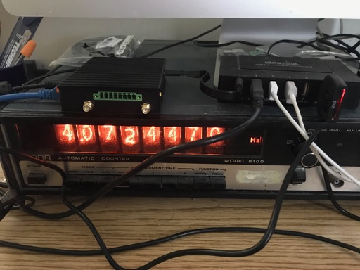

This is Rob's notes on the [IOT-GATE-iMX8](https://www.compulab.com/products/iot-gateways/iot-gate-imx8-industrial-arm-iot-gateway) single board computer from [Compulab](https://www.compulab.com).



Really Getting Started 
=======================

Get Console Working
-------------------

Compulab's [Getting Started](https://mediawiki.compulab.com/w/index.php?title=IOT-GATE-iMX8:_Getting_Started) page says fire up terminal program and connect to the serial port, but as USB device we generally need a driver. Based on their iM7 documentation, you'll need this one: [Silicon Labs USB to UART bridge drivers](https://www.silabs.com/products/development-tools/software/usb-to-uart-bridge-vcp-drivers/).

Install this for the appropriate plaform. On OS X, installation exposes the ```/dev/tty.SLAB_USBtoUART``` tty device. (What if you have more than one? I must have three or four FTDI USB to serial converters...)

```
[zircon: ~]% ls -1 /dev/tty*
(...)
/dev/tty.Bluetooth-Incoming-Port
/dev/tty.RobCalhoun-WirelessiAPv2
/dev/tty.SLAB_USBtoUART
(...)
```

I use ```screen``` on a Mac as a terminal emulator.

``` 
screen -U /dev/tty.SLAB_USBtoUART 115200
iot-gate-imx8 login: 
```

The documentation says to use ```root``` as a username and ```111111```, but I logged inwith an be empty string. You'll need to set a new password when you log in.

Looking Around
--------------

We're running Debian 10 (most recent release) on Linux 4.4, not super-up-date but an [LTS release](https://www.kernel.org) and fine choice for embedded work. (A lot of recent kernel work is focused on datacenters.) 

It uses systemd (sigh).

```
root@iot-gate-imx8:~# uname -a
Linux iot-gate-imx8 4.14.98-iot-gate-imx8-1.0 #1 SMP PREEMPT Sun Apr 26 17:26:48 IDT 2020 aarch64 GNU/Linux

root@iot-gate-imx8:~# lsb_release -a
No LSB modules are available.
Distributor ID: Debian
Description:    Debian GNU/Linux 10 (buster)
Release:        10
Codename:       buster

root@iot-gate-imx8:~# df
Filesystem     1K-blocks   Used Available Use% Mounted on
/dev/root       14974792 812460  13532316   6% /
devtmpfs          691288      0    691288   0% /dev
tmpfs            1019384      0   1019384   0% /dev/shm
tmpfs            1019384  25356    994028   3% /run
tmpfs               5120      0      5120   0% /run/lock
tmpfs            1019384      0   1019384   0% /sys/fs/cgroup
tmpfs             203876      0    203876   0% /run/user/0
```
812 MB! ```D00d```...

```
root@iot-gate-imx8:/usr# du -hs *
214M	bin
4.0K	games
84K	include
180M	lib
62M	libexec
4.9M	local
6.1M	sbin
236M	share
4.0K	src
```

Where's the disk space going? Docker (+ containerd) are the #1 offenders.
```
root@iot-gate-imx8:/usr# du -s bin/* | sort  -n | tail -n10
2520	bin/python2.7
2812	bin/docker-proxy
3312	bin/qemu-arm-static
3456	bin/python3.7
4892	bin/containerd-shim
6732	bin/runc
16224	bin/ctr
29404	bin/containerd
57940	bin/docker
67004	bin/dockerd
```

Peripherals
===========

WLAN / Wireless Modem
---------------------

The IOT-GATE-iMX8 has a Simcom SIM7600G 4G/LTE CAT1 cellular module via mini-PCie socket. I have not idea whether this has the relevant code approvals (FCC, PTCRB etc.) I 

From the manual:
> IOT-GATE-iMX8 cellular interface is implemented with a mini-PCIe modem module and a micro- SIM socket. In order to setup IOT-GATE-iMX8 for cellular functionality install an active SIM card into micro-SIM socket P12. The cellular module should be installed into mini-PCIe socket P8.


CompuLab's documentation is rather thin, so let's poke around. Two common connection managers are "connman" and "modemmanager".

```
root@iot-gate-imx8:~# mmcli --help
Usage:
  mmcli [OPTION…] - Control and monitor the ModemManager
(...)

root@iot-gate-imx8:~# connmanctl
-bash: connmanctl: command not found
```

So we have modemmanager. Moving on with ```mmctl```:

```
root@iot-gate-imx8:~# mmcli -m 0
  --------------------------
  General  |      dbus path: /org/freedesktop/ModemManager1/Modem/0
           |      device id: a055df9fad5aaf165e732253eee2c757c7598525
  --------------------------
  Hardware |   manufacturer: SIMCOM INCORPORATED
           |          model: SIMCOM_SIM7600G
           |       revision: LE20B01SIM7600M21-A
           |      supported: gsm-umts
           |        current: gsm-umts
           |   equipment id: 868822040015099
  --------------------------
  System   |         device: /sys/devices/platform/32e50000.usb/ci_hdrc.1/usb2/2-1/2-1.5
           |        drivers: qmi_wwan, option1
           |         plugin: SimTech
           |   primary port: ttyUSB2
           |          ports: ttyUSB0 (qcdm), ttyUSB2 (at), ttyUSB3 (at), wwan0 (net)
  --------------------------
  Status   |          state: failed
           |  failed reason: sim-missing
           |    power state: on
           | signal quality: 0% (cached)
  --------------------------
  Modes    |      supported: allowed: any; preferred: none
           |        current: allowed: any; preferred: none
root@iot-gate-imx8:~# 
```

No SIM. OK, that is reasonable. I'll need to order a micro-SIM card and set up service. 


Ethernet
--------
This was pleasant.

* plug in a cable
* pulls dhcp address audiomatically

sshd is installed and running but not allowing connections:
```
[zircon: ~]% ssh root@192.168.2.57
Connection reset by 192.168.2.57 port 22
[zircon: ~]% telnet 192.168.2.57 22
Trying 192.168.2.57...
Connected to 192.168.2.57.
Escape character is '^]'.
SSH-2.0-OpenSSH_7.9p1 Debian-10+deb10u2

root@iot-gate-imx8:~# systemctl status ssh
● ssh.service - OpenBSD Secure Shell server
   Loaded: loaded (/lib/systemd/system/ssh.service; enabled; vendor preset: enab
   Active: active (running) since Mon 2020-05-18 05:43:56 UTC; 2 months 22 days 

Aug 09 18:56:51 iot-gate-imx8 sshd[3267]: error: Could not load host key: /etc/s
Aug 09 18:56:51 iot-gate-imx8 sshd[3267]: fatal: No supported key exchange algor
Aug 09 18:56:59 iot-gate-imx8 sshd[3270]: error: Could not load host key: /etc/s
(...)
root@iot-gate-imx8:~# 
```

We need to set up host keys. See directions from the [iMX7 setup](https://mediawiki.compulab.com/index.php/CL-SOM-iMX7:_Linux:_Debian#SSH_Server):

```
dpkg-reconfigure openssh-server

Creating SSH2 RSA key; this may take some time ...
```

Add our pubkey via console:
```
root@iot-gate-imx8:~# mkdir .ssh
root@iot-gate-imx8:~# ls
root@iot-gate-imx8:~# cat > authorized_keys
ssh-rsa AAAA...
^D
```

What do you do without console access? Password logins seem to be disabled. Anyway, with pubkey set we can log in via ssh.
```
[zircon: ~]% ssh root@192.168.2.57 -i ~/.ssh/rcalhoun-sst-ssh-key-4096
Warning: Permanently added '192.168.2.57' (ECDSA) to the list of known hosts.
Linux iot-gate-imx8 4.14.98-iot-gate-imx8-1.0 #1 SMP PREEMPT Sun Apr 26 17:26:48 IDT 2020 aarch64
```

GPS
---
I haven't plugged in an antenna yet, and I'm not going to be able to today because it is a reverse polarity SMA connector like the wifi and cellular antenna connectors. See this [SMA vs RP-SMA discussion](https://quadquestions.com/blog/2015/07/28/sma-connector-selection-guide-sma-vs-rpsma/).

Ordered some [SMA to RP-SMA connections](https://www.amazon.com/gp/product/B07W9HLQFL) from J.B. & Co.

Let's see what we have software-wise. I'd expected we have ```gpsd```.
```
root@iot-gate-imx8:~# type gpsd
gpsd is /usr/sbin/gpsd
```
I don't see it running, but GPSD is one of these programs that only runs when someone "needs" to run it. So we have to make some demands. 
```
root@iot-gate-imx8:/etc/init.d# cgps 
┌───────────────────────────────────────────┐┌─────────────────────────────────┐
│    Time:       n/a                        ││PRN:   Elev:  Azim:  SNR:  Used: │
│    Latitude:   n/a                        ││                                 │
│    Longitude:  n/a                        ││                                 │
│    Altitude:   n/a                        ││                                 │
│    Speed:      n/a                        ││                                 │
│    Heading:    n/a                        ││                                 │
│    Climb:      n/a                        ││                                 │
│    Status:     NO FIX (0 secs)            ││                                 │
│    Longitude Err:   n/a                   ││                                 │
│    Latitude Err:    n/a                   ││                                 │
│    Altitude Err:    n/a                   ││                                 │
│    Course Err:      n/a                   ││                                 │
│    Speed Err:       n/a                   ││                                 │
│    Time offset:     n/a                   ││                                 │
│    Grid Square:     n/a                   ││                                 │
└───────────────────────────────────────────┘└─────────────────────────────────┘
{"class":"VERSION","release":"3.17","rev":"3.17","proto_major":3,"proto_minor":12}

":9600,"parity":"N","stopbits":1,"cycle":1.00}]}
{"class":"WATCH","enable":true,"json":true,"nmea":false,"raw":0,"scaled":false,"timing":false,"split24":false,"pps":false}
```

Look around:

```
root@iot-gate-imx8:/etc# find . -name "gpsd"
./init.d/gpsd
./default/gpsd
root@iot-gate-imx8:/etc# cd default/
root@iot-gate-imx8:/etc/default# more gpsd 
# Default settings for the gpsd init script and the hotplug wrapper.

# Start the gpsd daemon automatically at boot time
START_DAEMON="true"

# Use USB hotplugging to add new USB devices automatically to the daemon
USBAUTO="true"

# Devices gpsd should collect to at boot time.
# They need to be read/writeable, either by user gpsd or the group dialout.
DEVICES="/dev/ttyUSB1"

# Other options you want to pass to gpsd
GPSD_OPTIONS=""
root@iot-gate-imx8:/etc/default# 
```

Well, seems ok but we'll have to wait for the SMA converter.


Software Load
=============

What is installed
------------------
```
systemctl
(lots of stuff)
systemctl list-unit-files
(lots of stuff)
```


System Logging
==============

I'm not familiar with current debians so it's taking me a while to find where the syslogends up.

Linux message command ```dmesg``` works. I don't know whther syslog is stored somewhere else or is disabled.;
```
root@iot-gate-imx8:/var/log# ls -l
total 24
-rw-rw---- 1 root utmp 2304 Aug  9 19:03 btmp
-rw-r--r-- 1 root root   43 May 18 05:48 dpkg.log
-rw-rw-r-- 1 root utmp  292 Aug  9 19:05 lastlog
drwx------ 2 root root 4096 Feb 14  2019 private
-rw-rw-r-- 1 root utmp 5376 Aug  9 19:05 wtmp
root@iot-gate-imx8:/var/log# 
```

